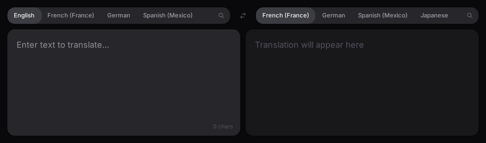

# TranslateGemma UI

[](https://github.com/realies/translategemma-ui/actions)
[](https://hub.docker.com/r/realies/translategemma-ui)
[](https://hub.docker.com/r/realies/translategemma-ui)

Web interface for [TranslateGemma](https://blog.google/innovation-and-ai/technology/developers-tools/translategemma/), Google's open translation model.



## Features

- **55 languages** — searchable language selector with recent language pills
- **Auto-translate** — starts translating as you type, no button needed
- **Local inference** — no data leaves your machine, powered by OpenWebUI + Ollama
- **Remembers preferences** — last used language pair and recents restored on reload
- **Swap languages** — flip source and target with one click
- **Translation stats** — shows duration and token count after each translation
- **Rate limiting** — built-in per-IP rate limiter for API requests
- **Localized UI** — interface labels adapt to your browser's language
- **Light & dark mode** — follows your system preference
- **Enterprise SSO** — optional OIDC login flow with Zitadel-compatible defaults
- **Multi-arch Docker** — native images for `linux/amd64` and `linux/arm64`

## Quick Start

```yaml
services:
  translategemma-ui:
    image: realies/translategemma-ui
    container_name: translategemma-ui
    restart: unless-stopped
    ports:
      - 3000:3000
    environment:
      - LLM_PROVIDER=openai
      - OPENAI_BASE_URL=http://host.docker.internal:8080/api
      - OPENAI_API_KEY=
      - DEFAULT_MODEL=translategemma:27b
    extra_hosts:
      - "host.docker.internal:host-gateway"
```

Access the UI at `http://localhost:3000`

## Requirements

OpenWebUI running with Ollama connected and a TranslateGemma model available:

```bash
ollama pull translategemma:27b   # best quality (~16GB)
ollama pull translategemma:12b   # balanced (~7GB)
ollama pull translategemma:4b    # fastest (~2.5GB)
```

## Configuration

| Variable                        | Default                     | Description                                                              |
| ------------------------------- | --------------------------- | ------------------------------------------------------------------------ |
| `LLM_PROVIDER`                  | `openai`                    | Provider mode: `openai` (OpenAI-compatible) or `ollama`                  |
| `OPENAI_BASE_URL`               | `http://localhost:8080/api` | OpenAI-compatible base URL (for OpenWebUI use `/api`)                    |
| `OPENAI_CHAT_COMPLETION_PATH`   | _(auto)_                    | Optional path override for providers with custom chat path               |
| `OPENAI_API_KEY`                | _(empty)_                   | Optional bearer token for protected OpenAI-compatible endpoints          |
| `OLLAMA_URL`                    | `http://localhost:11434`    | Ollama API URL (used when `LLM_PROVIDER=ollama`)                         |
| `DEFAULT_MODEL`                 | `translategemma:27b`        | Model to use (`27b`, `12b`, or `4b`)                                     |
| `OIDC_ENABLED`                  | `false`                     | Enable OIDC login gate (`true` to require SSO)                           |
| `OIDC_ISSUER_URL`               | _(empty)_                   | OIDC issuer URL (example: `https://<tenant>.zitadel.cloud`)              |
| `OIDC_CLIENT_ID`                | _(empty)_                   | OIDC client ID (public SPA client)                                       |
| `OIDC_REDIRECT_URI`             | _(current URL)_             | Optional redirect URI for code flow callback                             |
| `OIDC_SCOPES`                   | `openid profile email`      | OIDC scopes to request                                                   |
| `OIDC_POST_LOGOUT_REDIRECT_URI` | _(empty)_                   | Optional post-logout redirect target (must be registered exactly in IdP) |
| `PORT`                          | `3000`                      | Server port                                                              |
| `HOST`                          | `0.0.0.0`                   | Server host                                                              |

## OIDC / Zitadel setup

To require SSO before using the translator, set `OIDC_ENABLED=true` and configure both `OIDC_ISSUER_URL` and `OIDC_CLIENT_ID`.

Example with Zitadel:

```env
OIDC_ENABLED=true
OIDC_ISSUER_URL=https://<your-tenant>.zitadel.cloud
OIDC_CLIENT_ID=<your-spa-client-id>
OIDC_REDIRECT_URI=http://localhost:3000
OIDC_SCOPES=openid profile email
OIDC_POST_LOGOUT_REDIRECT_URI=http://localhost:3000
```

Important for Zitadel: register `OIDC_REDIRECT_URI` and `OIDC_POST_LOGOUT_REDIRECT_URI` exactly as provided (no trailing slash in the example above).

Behavior:

- When `OIDC_ENABLED=true` and the user is not signed in, the homepage shows **Login with SSO**.
- After login, the app shows the user email and **Logout** button in the top-right panel.
- If `OIDC_ENABLED=false` (default), the app behaves as before (no login gate).

## Supported Languages

Arabic, Bengali, Bulgarian, Catalan, Chinese (Simplified/Traditional), Croatian, Czech, Danish, Dutch, English, Estonian, Filipino, Finnish, French (Canada/France), German, Greek, Gujarati, Hebrew, Hindi, Hungarian, Icelandic, Indonesian, Italian, Japanese, Kannada, Korean, Latvian, Lithuanian, Malayalam, Marathi, Norwegian, Persian, Polish, Portuguese (Brazil/Portugal), Punjabi, Romanian, Russian, Serbian, Slovak, Slovenian, Spanish (Mexico), Swahili, Swedish, Tamil, Telugu, Thai, Turkish, Ukrainian, Urdu, Vietnamese, Zulu

## Tech Stack

- [TanStack Start](https://tanstack.com/start) — React 19 full-stack framework
- [Tailwind CSS](https://tailwindcss.com) — styling
- [TypeScript](https://www.typescriptlang.org) — type safety
